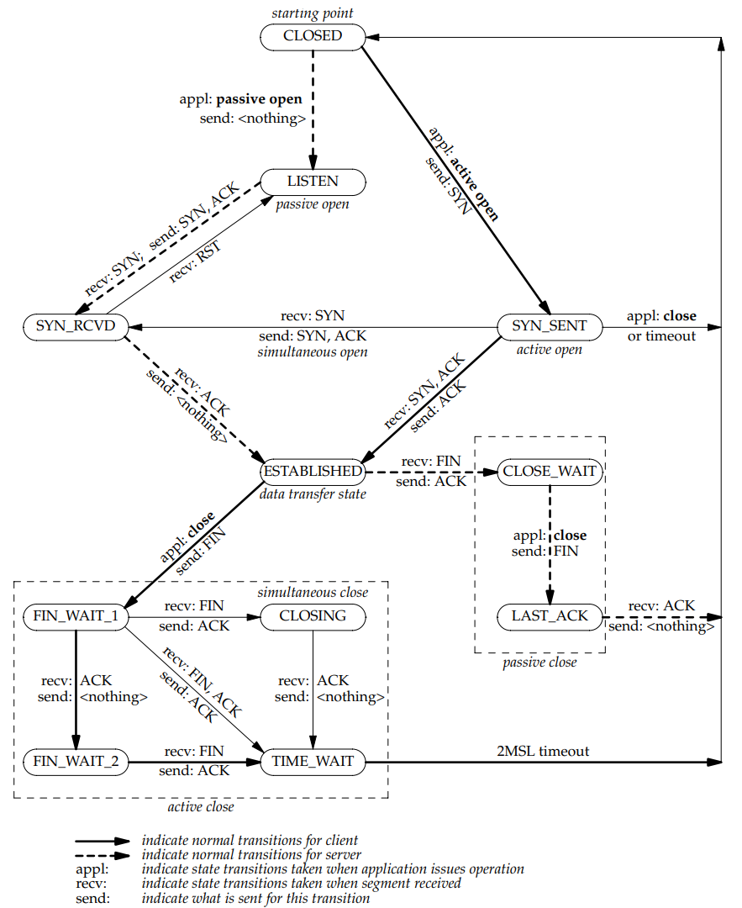

# 连接和断开

为什么不能简化成三次：SYN报文可能因为乱序或者重复到延迟到达server，服务器无法知道是否是过期，或者重复的报文。通过的第三次ACK确认，否则客户端响应RST终止。
关闭连接为什么需要四次：对方可能还有数据要发送。
**TIME_WAIT** 保证被动关闭方顺利关闭，即确认对端已收到FIN对应的ACK,防止迟来的数据段被后面的连接收到。等2MSL（maximum segment lifetime）1个 MSL 保证四次挥手中主动关闭方最后的 ACK 报文能最终到达对端，1个 MSL 保证对端没有收到 ACK 那么进行重传的 FIN 报文能够到达。

# 常用参数
| 参数名           | 功能描述                                                                           |
| ---------------- | ---------------------------------------------------------------------------------- |
| SO_REUSEADDR     | 允许套接字绑定到已使用的地址，便于快速重启服务器。                                   |
| SO_REUSEPORT     | 允许多个套接字绑定到相同的端口，用于负载均衡等场景。                                 |
| SO_KEEPALIVE     | 开启心跳检测机制，确保长时间未活动的连接不会中断。                                   |
| SO_LINGER        | 设定延迟关闭选项，当套接字关闭时发送完所有数据再释放资源。                           |
| SO_RCVBUF        | 设置接收缓冲区的大小，影响 TCP 接收窗口大小，优化网络传输性能。                       |
| SO_SNDBUF        | 设置发送缓冲区的大小，影响 TCP 发送窗口大小，优化数据发送性能。                       |
| SO_RCVTIMEO      | 设置接收超时时间，超过时间后未接收到数据将返回超时错误。                             |
| SO_SNDTIMEO      | 设置发送超时时间，超过时间后数据未发送将返回超时错误。                               |
| SO_ACCEPTCONN    | 检查套接字是否处于监听状态，用于服务器端的连接监听状态查询。                         |
| SO_ERROR         | 获取套接字的错误状态，用于诊断网络问题。                                             |
| SO_TYPE          | 获取套接字类型（如流式套接字、数据报套接字等），用于套接字属性查询。                  |
| SO_DONTROUTE     | 禁用路由表，直接发送数据包，用于诊断或优化某些场景的网络性能。                         |
| SO_BROADCAST     | 允许发送广播数据包，一般用于 UDP 组播或局域网内的消息广播。                           |

| 参数                       | 描述                                                                                                           | 默认值                | 优化值                |
|----------------------------|----------------------------------------------------------------------------------------------------------------|-----------------------|-----------------------|
| net.core.rmem_default      | 默认的 TCP 数据接收窗口大小（字节）。                                                                          | 229376                | 256960                |
| net.core.rmem_max          | 最大的 TCP 数据接收窗口（字节）。                                                                              | 131071                | 513920                |
| net.core.wmem_default      | 默认的 TCP 数据发送窗口大小（字节）。                                                                          | 229376                | 256960                |
| net.core.wmem_max          | 最大的 TCP 数据发送窗口（字节）。                                                                              | 131071                | 513920                |
| net.core.netdev_max_backlog| 当接收数据包的速率超过内核处理速率时，允许进入队列的数据包最大数目。                                          | 1000                  | 2000                  |
| net.core.somaxconn         | 系统中每一个端口的监听队列最大长度（全局参数）。                                                              | 128                   | 2048                  |
| net.core.optmem_max        | 每个套接字允许的最大缓冲区大小。                                                                               | 20480                 | 81920                 |
| net.ipv4.tcp_mem           | TCP 栈内存使用情况定义，分别表示内存使用下限、压力上限和绝对上限（单位：内存页）。                           | 94011 125351 188022   | 131072 262144 524288  |
| net.ipv4.tcp_rmem          | 自动调优接收缓冲区定义，依次为最小、默认、最大值。                                                             | 4096 87380 4011232    | 8760 256960 4088000   |
| net.ipv4.tcp_wmem          | 自动调优发送缓冲区定义，依次为最小、默认、最大值。                                                             | 4096 16384 4011232    | 8760 256960 4088000   |
| net.ipv4.tcp_keepalive_time| TCP 发送 keepalive 探测消息的间隔时间（秒）。                                                                 | 7200                  | 1800                  |
| net.ipv4.tcp_keepalive_intvl| 探测消息无响应时的重发间隔时间（秒）。                                                                       | 75                    | 30                    |
| net.ipv4.tcp_keepalive_probes| TCP 连接失效前的最多 keepalive 探测次数。                                                                  | 9                     | 3                     |
| net.ipv4.tcp_sack          | 启用选择性应答（1 表示启用），对乱序报文提高性能。                                                            | 1                     | 1                     |
| net.ipv4.tcp_fack          | 启用转发应答减少拥塞，应开启此选项。                                                                         | 1                     | 1                     |
| net.ipv4.tcp_timestamps    | 启用时间戳计算 RTT 提升性能，开启选项。                                                                       | 1                     | 1                     |
| net.ipv4.tcp_window_scaling| 启用 window scaling 以支持超过 64KB 的 TCP 窗口。                                                             | 1                     | 1                     |
| net.ipv4.tcp_syncookies    | 启用同步标签防止过载。                                                                                        | 1                     | 1                     |
| net.ipv4.tcp_tw_reuse      | 允许 TIME-WAIT 状态 socket 用于新的连接。                                                                     | 0                     | 1                     |
| net.ipv4.tcp_tw_recycle    | 快速回收 TIME-WAIT 套接字。                                                                                   | 0                     | 1                     |
| net.ipv4.tcp_fin_timeout   | FIN-WAIT-2 状态的 socket 连接保持时间（秒）。                                                                  | 60                    | 30                    |
| net.ipv4.ip_local_port_range| 可用的本地端口号范围。                                                                                       | 32768 61000           | 1024 65000            |
| net.ipv4.tcp_max_syn_backlog| 等待确认的连接请求队列最大数，服务器过载时可增加此值。                                                       | 2048                  | 2048                  |

# 所有状态

